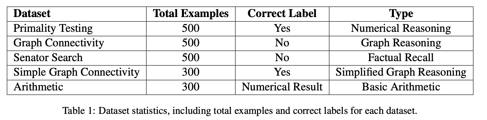
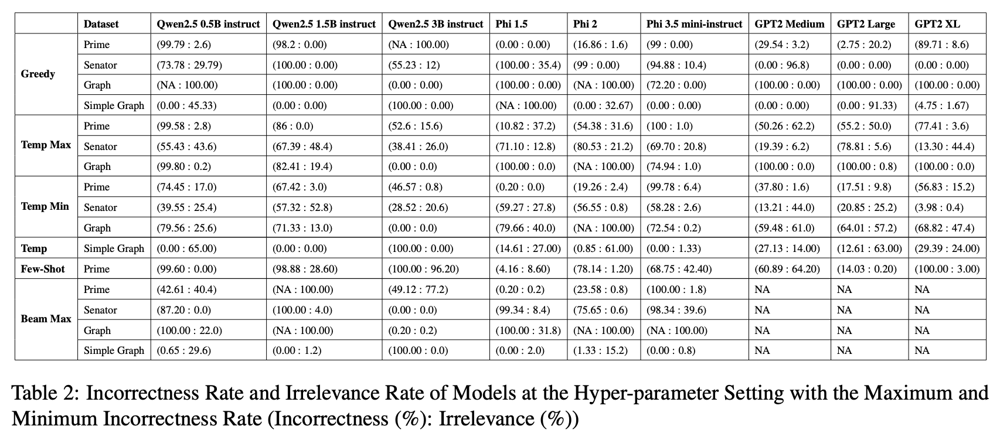
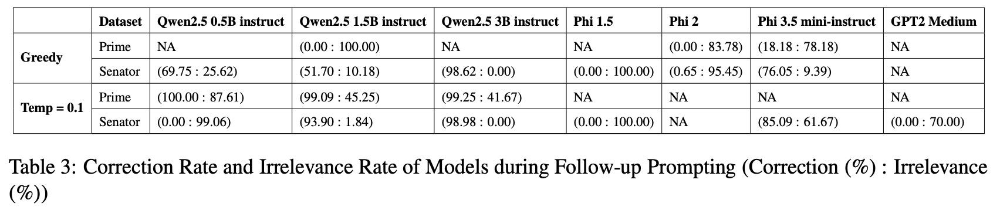
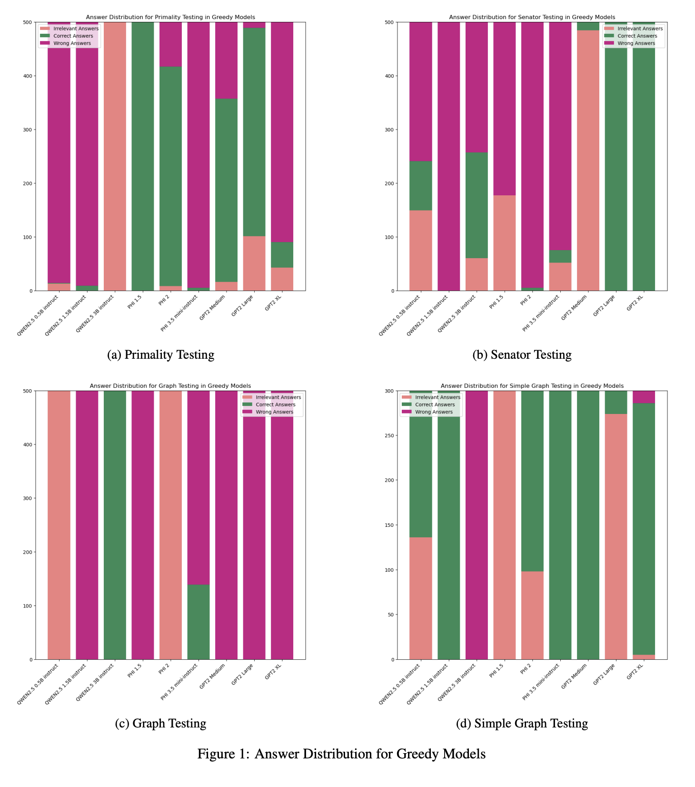
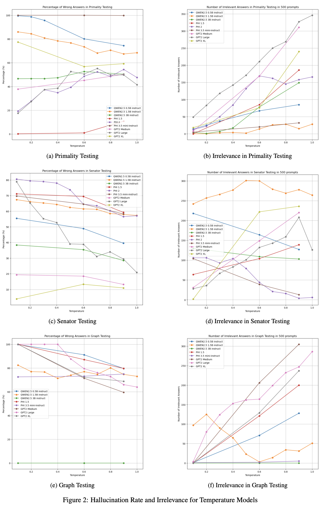
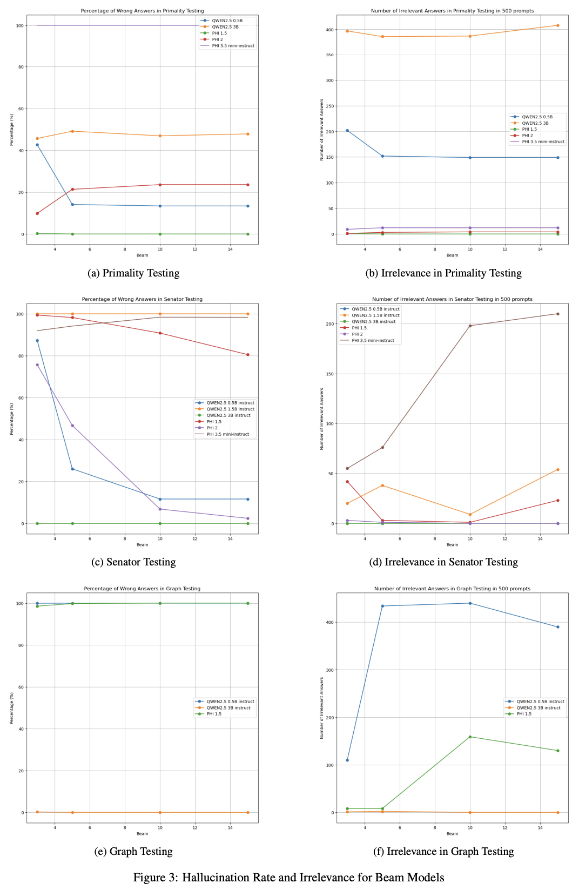
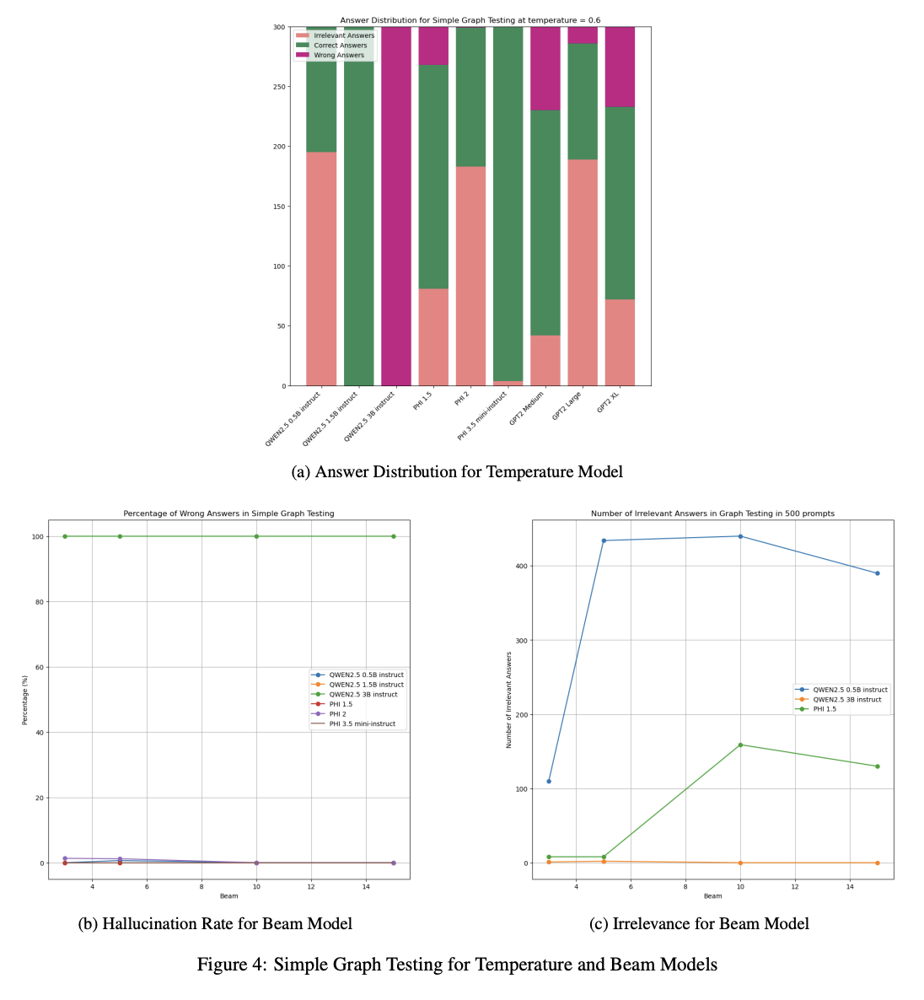
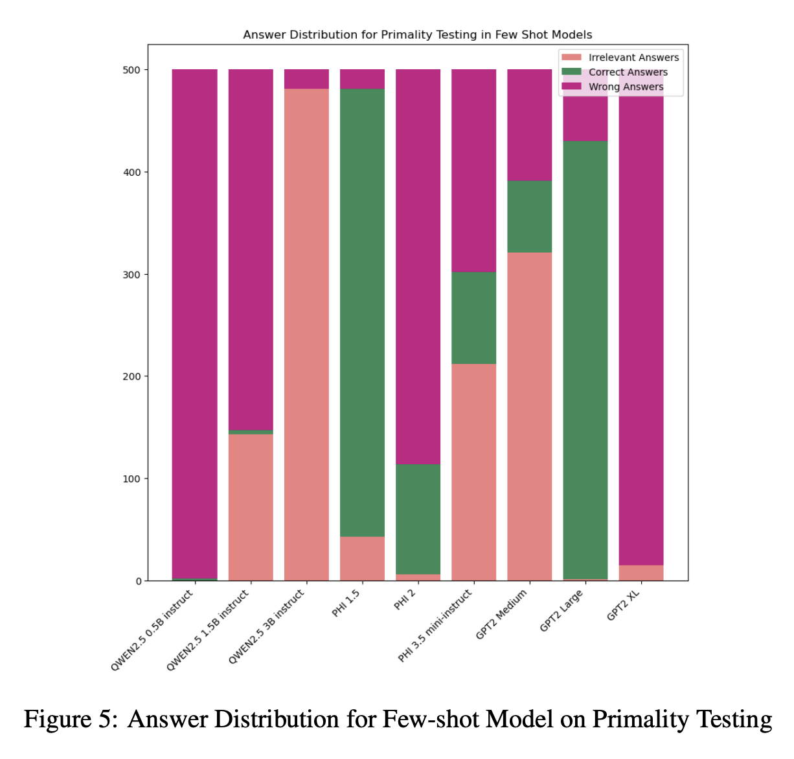
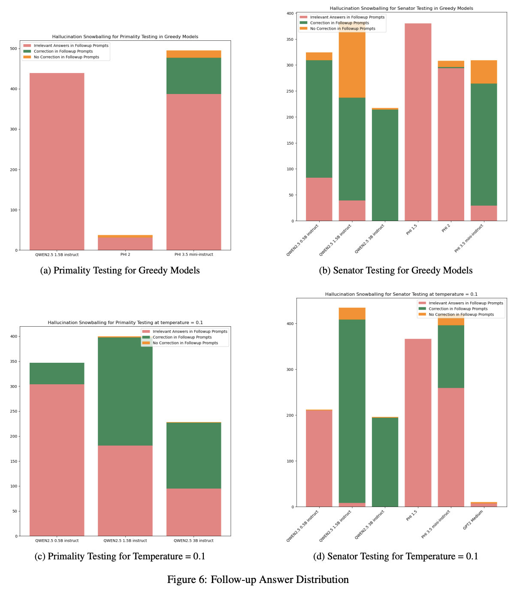

# Mitigating Snowball Hallucinations in Small Language Models

This repository is the official implementation of research project Mitigating Snowball Hallucinations in Small Language Models of COMP 767, Fall 2024, McGill University.

## Requirements

To install requirements:

```setup
pip3 install torch torchvision torchaudio transformers json
```

## Datasets/Benchmark
The Benchmark folder contains five benchmark datasets.


## Inference/Testing

To test the model(s) in the paper, select the model script, adjust the benchmark file (i.e. Benchmark/primality_testing.json) and adjust the hyperparameter (max_length, max_new_token, temperature, num_beams, do_sample). Then run the script.

For example:

```train
python3 phi_1B.py
```

## Evaluation

The TestRun.ipynb file contains the evaluation of results and the produced graphs.

## Results








